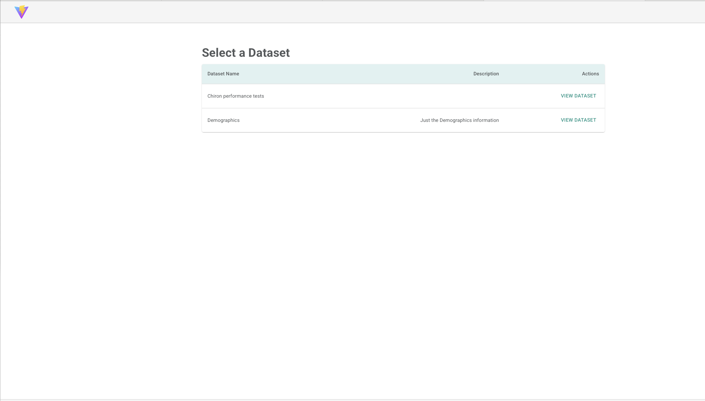
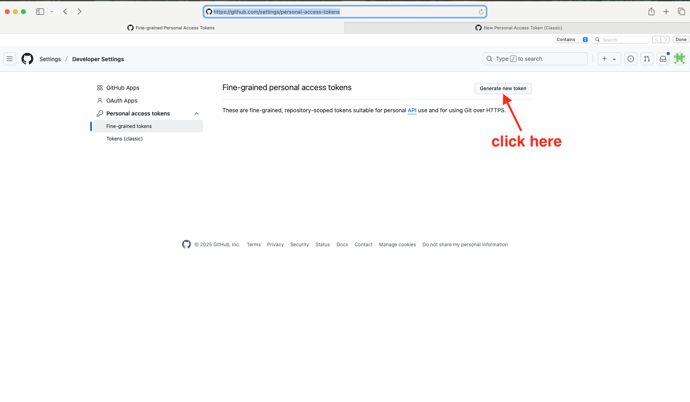
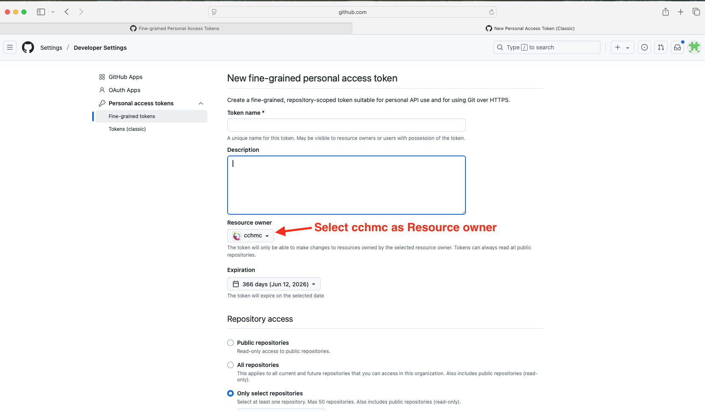

# Chiron Admin Collab

A Dockerized deployment of the IS4R-Chiron platform with an updated UI. This application streamlines data management and analysis for IS4R research workflows.

> ⚠️ **Note:** You must have access to the `cchmc` GitHub organization and the private `is4r-chiron` repositories.

---

## 🖼️ UI Preview


<sub>*Chiron Admin Dashboard — example interface*</sub>

---

## 🚀 Quick Start

Follow the steps below to get the platform running locally using Docker.

---

### 1. 🔑 Generate a GitHub Personal Access Token

1. Go to [GitHub Personal Access Tokens](https://github.com/settings/personal-access-tokens)



2. Under **Resource owner**, select **`cchmc`**



3. Name your token, provide an expiration date
4. For repository access, choose:
   - **All repositories**, or
   - **Only select repositories** → Include `cchmc/is4r-chiron`
5. Under **Permissions**, enable:
   - `Contents` → **Read-only**
   - `Secrets` → **Read-only**
6. Generate and copy the token

---

### 2. ⚙️ Configure the `.env` File

In the root of the `chiron-admin-collab` directory, create a `.env` file:

```env
CHIRON_AUTH=your_generated_token_here
````

This token allows the Docker build to access the private Chiron repository.

---

### 3. 🐳 Start the Docker Containers

From your terminal or command prompt, run:

```bash
BUILD_NUMBER=1 docker-compose up -d
```

This builds and launches all services in detached mode.

---

### 4. ♻️ Restore Project State and Load Data

Run the following commands to initialize the database and load a demo dataset:

```bash
BUILD_NUMBER=1 docker-compose exec api python manage.py makemigrations
BUILD_NUMBER=1 docker-compose exec api python manage.py restore_project_state
BUILD_NUMBER=1 docker-compose exec api python manage.py chiron_run_etl --abbreviated
```

Select the dataset you'd like to load when prompted.

---

### 5. 🔐 Create Superuser for Admin Panel

```bash
BUILD_NUMBER=1 docker-compose exec api python manage.py createsuperuser
```

Create credentials when prompted. You’ll use these to log in to the Django admin site.

---

## 🌐 Access the Application

* **Admin Interface**: [http://localhost:13001/admin/](http://localhost:13001/admin/)
  → Use the superuser credentials you just created.

* **Chiron UI**: [http://localhost:13000](http://localhost:13000)

---

## 📁 Project Structure

```
chiron-admin-collab/
├── .env
├── docker-compose.yml
├── src/
│   ├── ui/
│   └── backend/
├── docs/
│   └── chiron-ui-screenshot.png
└── README.md
```

---

## 📝 License & Access

This project is internal to the CCHMC organization and not intended for public use. For access, usage, or licensing questions, contact the project administrator.

---