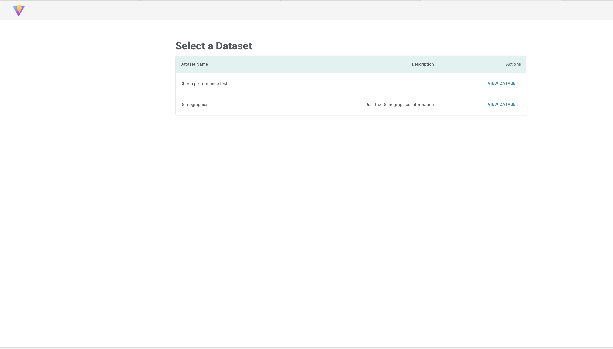
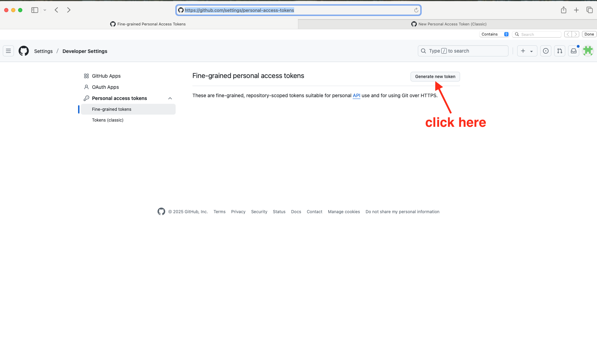
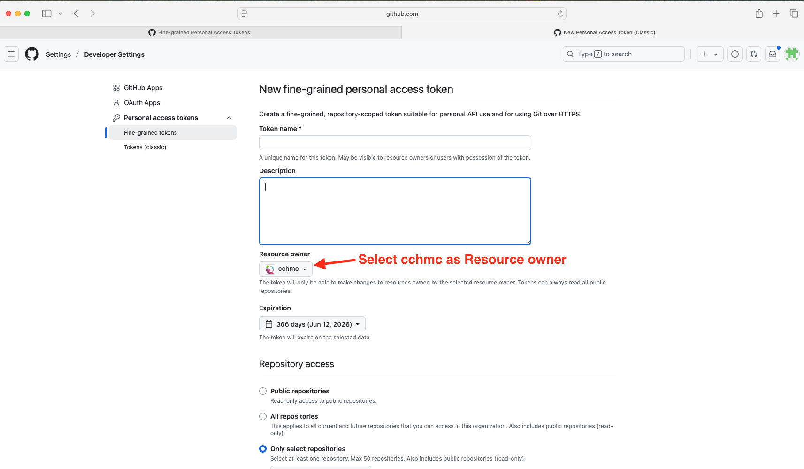

# Chiron Admin Collab

A Dockerized data store deployment of the IS4R-Chiron platform with an updated UI. This application streamlines data management and analysis with integrated medical ontology support and includes multiple research datasets for testing and development.

> ⚠️ **Note:** You must have access to the `cchmc` GitHub organization and the private `is4r-chiron` and `is4r-chiron-ontology` repositories.

---

## 🖼️ UI Preview


<sub>*Chiron Admin Dashboard — example interface*</sub>

---

## 🚀 Quick Start

Follow the steps below to get the platform running locally using Docker.

### 1. 📥 Clone Repository
```bash
git clone https://github.com/cchmc/is4r-chiron.git
cd "Chiron app"
```

### 2. 🔑 Generate a GitHub Personal Access Token

1. Go to [GitHub Personal Access Tokens](https://github.com/settings/personal-access-tokens)



2. Under **Resource owner**, select **`cchmc`**



3. Name your token, provide an expiration date
4. For repository access, choose:
   - **All repositories**, or
   - **Only select repositories** → Include `cchmc/is4r-chiron` and `cchmc/is4r-chiron-ontology`
5. Under **Permissions**, enable:
   - `Contents` → **Read-only**
   - `Secrets` → **Read-only**
6. Generate and copy the token

### 3. ⚙️ Configure the `.env` File

In the root of the `chiron-admin-collab` directory, create a `.env` file:

```env
CHIRON_AUTH=your_generated_token_here
```

This token allows the Docker build to access the private Chiron repository.

### 4. 🐳 Start containers and initialize the app (run in order)

```bash
BUILD_NUMBER=1 docker-compose up -d
BUILD_NUMBER=1 docker-compose exec api python manage.py makemigrations
BUILD_NUMBER=1 docker-compose exec api python manage.py migrate
BUILD_NUMBER=1 docker-compose exec api python manage.py chiron_restore_dd

BUILD_NUMBER=1 docker-compose exec api python manage.py chiron_autocreate_dd
BUILD_NUMBER=1 docker-compose exec api python manage.py createsuperuser --username admin --email admin@example.com
BUILD_NUMBER=1 docker-compose exec api python manage.py chiron_run_etl all

BUILD_NUMBER=1 docker-compose exec api python manage.py ontology_load --o chiron_config/data/source_data/ontology_source/fyler_test.json
BUILD_NUMBER=1 docker-compose exec api python manage.py chiron_restore_dataset dataset2_stored.json   
BUILD_NUMBER=1 docker-compose exec api python manage.py chiron_run_etl dataset2_stored

# (optional, if prompted later or schema updates occur)
BUILD_NUMBER=1 docker-compose exec api python manage.py makemigrations
BUILD_NUMBER=1 docker-compose exec api python manage.py migrate
```

### 5. 👥 Configure User Access

After completing the initialization:

1. **Access Admin Panel**: Go to http://localhost:13001/admin/
2. **Log in** with the admin credentials (`admin` / password you set during superuser creation)
3. **Create Chiron User**: 
   - Navigate to "Chiron users" section
   - Click "Add chiron user"
   - Link your Django admin user to a new Chiron user
   - **Grant dataset access** to all available datasets:
     - Chiron Performance Tests
     - Demographics
     - Synthea
     - dataset2_stored
4. **Verify Dataset Access**: 
   - Go to [http://localhost:13000](http://localhost:13000) 
   - Check that you can see and access all datasets of interest
   - If any datasets are missing, return to admin panel to add the Chiron user and grant permissions

> 📋 **Important**: The admin user must be added as a Chiron user and granted dataset permissions to access the research data interface. Always verify access in the UI after setup.

---

## 🧬 Ontology Support

This platform includes medical ontology integration for standardized terminology:

- **Fyler Ontology**: Cardiovascular disease terminology system loaded via `fyler_test.json`
- **Features**: 
  - Hierarchical medical concept browsing
  - Standardized coding for patient data
  - Ontology-based search and filtering
  - ~3,690 cardiovascular disease terms

The ontology system enables researchers to code medical history and conditions using standardized terminology for improved data consistency and interoperability.

---

## 📊 Available Datasets

This Dockerized data store includes the following datasets for research and testing:

### **Chiron Performance Tests**
- **Type**: Synthetic test data generated with Faker library for performance benchmarking
- **Purpose**: System performance testing and load validation
- **Access**: Should be available after initialization

### **Demographics Dataset** 
- **Type**: Synthetic patient demographics generated with Faker library (seeded for reproducibility)
- **Records**: 40,000 synthetic patient records
- **Data**: Names, ages, genders, addresses, medical record numbers, and other demographic fields
- **Generator**: SourcePatient processor with deterministic seed (4816) for consistent data generation
- **Access**: Should be available after initialization

### **Synthea Dataset**
- **Type**: Synthetic healthcare data generated by Synthea™ Patient Generator
- **Description**: Pre-built demo dataset with comprehensive synthetic patient medical histories
- **Source**: [Synthea™ Patient Generator](https://synthetichealth.github.io/synthea/) - an open-source synthetic patient generator that models realistic medical histories
- **Features**: Complete patient journeys including encounters, medications, procedures, and conditions
- **Access**: Available after initialization

### **dataset2_stored** *(ontology-enabled)*
- **Type**: Ontology-integrated research dataset
- **Features**:
  - Autocreated from CSV files with subject matching
  - Multi-dataset system testing
  - Complex subject matching algorithms
  - Custom ETL processors (detailed age, deidentified IDs)
  - Ontology integration for standardized medical coding
- **Access**: Loaded via `chiron_restore_dataset dataset2_stored.json`

> 🔍 **Verification**: After setup, check [http://localhost:13000](http://localhost:13000) to verify you have access to all datasets. If any datasets are missing, ensure you've added a Chiron user and granted appropriate dataset permissions via the admin interface.

---

## 🔧 Data Generation Pipeline

The platform uses a sophisticated data generation system:

### **SourcePatient Processor**
- **Location**: `chiron_config.processors.source_patient.SourcePatient`
- **Function**: Generates synthetic patient demographic data using Faker library
- **Seeding**: Uses deterministic seed (4816) for reproducible results
- **Output**: 40,000 consistent synthetic patient records per initialization

### **Data Flow Architecture**
```
Dataset Definition (full_dd.json)
    ↓
Collection Configuration
    ↓
Source Processor Assignment
    ↓
Faker Library Generation
    ↓
Synthetic Patient Records
```

This architecture ensures reproducible, consistent synthetic data for development and testing while maintaining medical data privacy standards.

---

## 🌐 Access the Application

* **Admin Interface**: [http://localhost:13001/admin/](http://localhost:13001/admin/)
  → Use the superuser credentials you just created.

* **Chiron UI**: [http://localhost:13000](http://localhost:13000)

---

## 📁 Project Structure

```
chiron-admin-collab/
├── .env
├── docker-compose.yml
├── src/
│   ├── ui/
│   └── backend/
├── docs/
│   └── chiron-ui-screenshot.png
└── README.md
```

---

## Citations & References

### Synthea™ Patient Generator
This project includes synthetic healthcare data generated by Synthea™:

- **Website**: https://synthetichealth.github.io/synthea/
- **Citation**: Walonoski, J., Kramer, M., Nichols, J., Quina, A., Moesel, C., Hall, D., Duffett, C., Dube, K., Gallagher, T., McLachlan, S. (2018). Synthea: An approach, method, and software mechanism for generating synthetic patients and the synthetic electronic health care record. *Journal of the American Medical Informatics Association*, 25(3), 230-238.
- **GitHub**: https://github.com/synthetichealth/synthea
- **License**: Apache License 2.0

### Data Privacy & Ethics
All datasets in this platform use synthetic data generated by validated open-source tools, ensuring no real patient information is used while maintaining realistic medical data patterns for research and development purposes.

---

## License & Access

This project is internal to the CCHMC organization and not intended for public use. For access, usage, or licensing questions, contact the project administrator.
